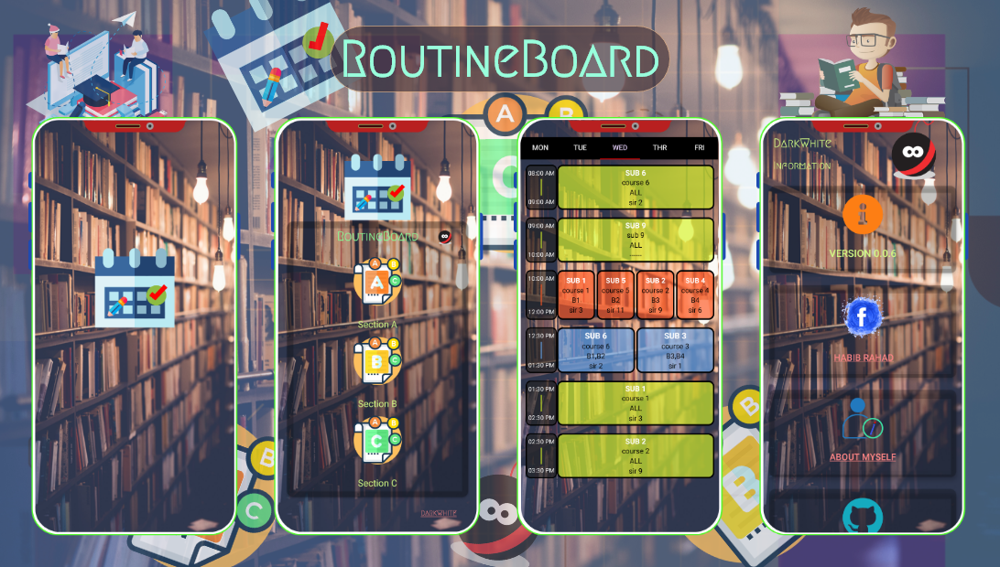
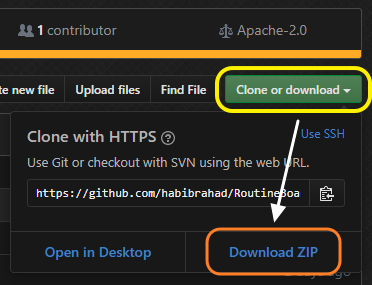
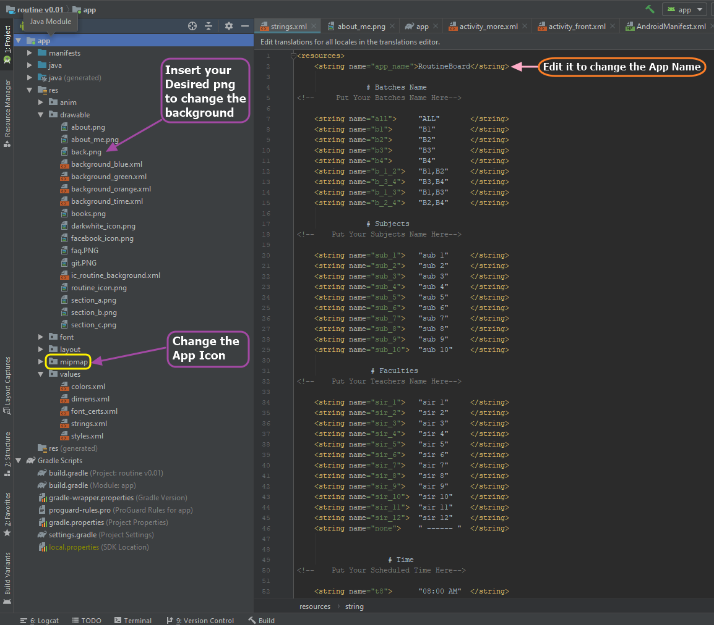
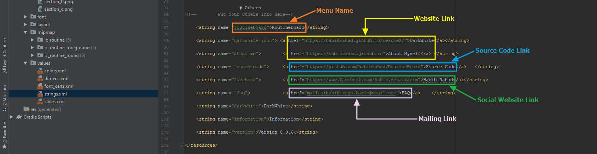
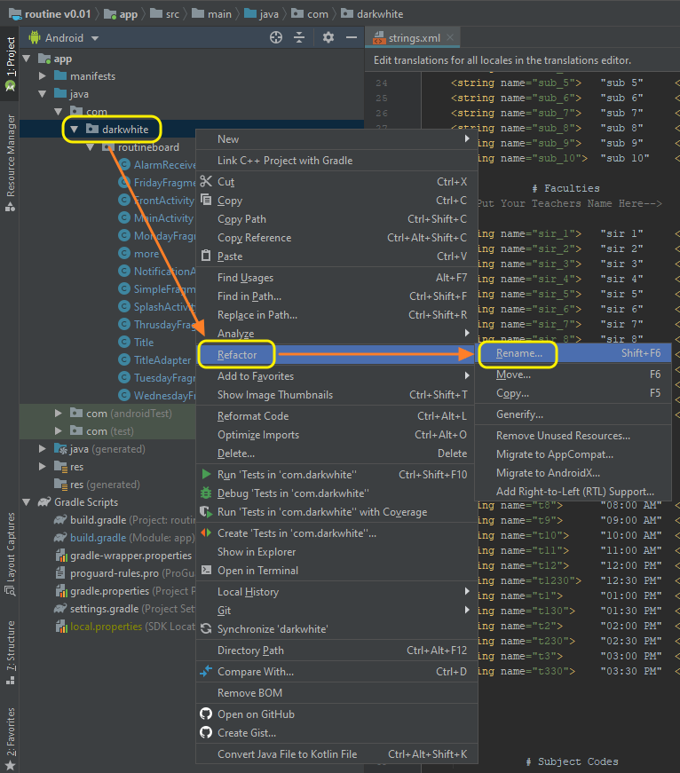
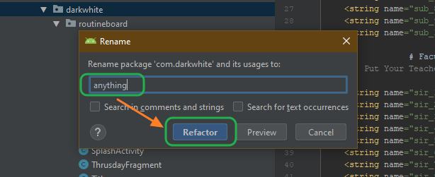
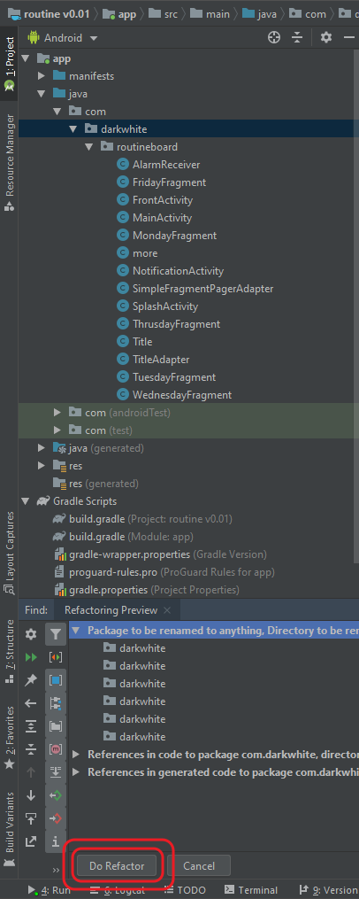
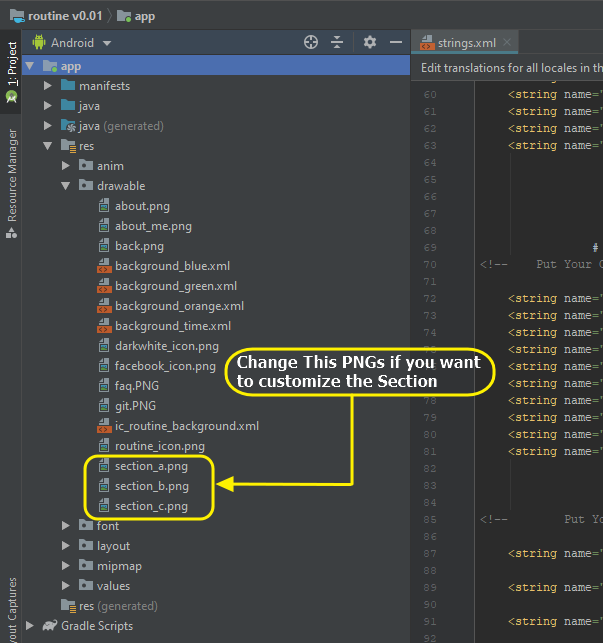
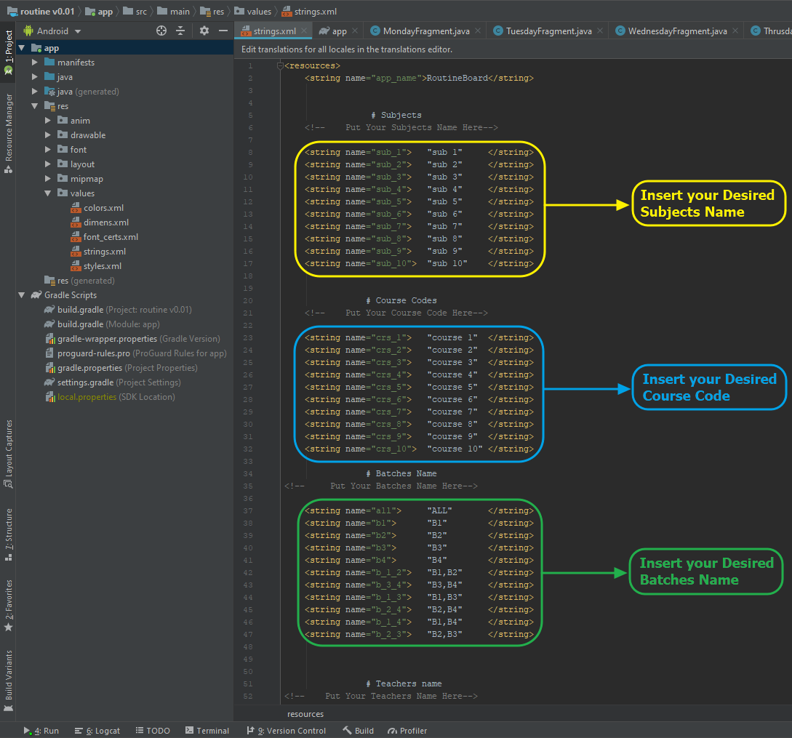
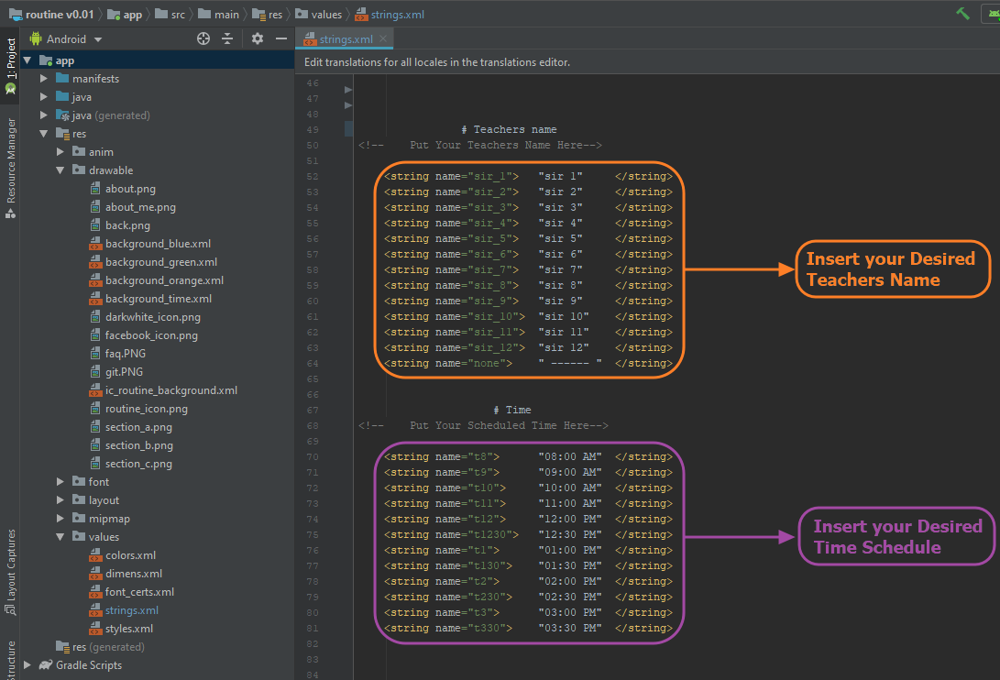

<html>

<head>
<link rel="stylesheet" type="text/css" href="css/style.css">

# RoutineBoard

**Requirements:**
- Android Studio 3.5 or better.
- JDK 8 or better.
- Android SDK 29.
- Supports API Level +21.

**Features**
- This Application Contain class routine of specific Institution.

- It can contain Upto 5 day's routine of any Educational Institution.

- By Default, 3 sections database have been added in This Application.

 
</b>

**Additional:**

- It will Appear your upcoming class routine without scrolling multiple times.

**Note:**

- It require no access from your Device.

- This Application is only for Educational Purposes. There is no intention to violent the Terms and Condition of Google Play.

- If one wants to use this Application for there Educational project, they can use the repository from this Git.

 

---

**Release** repository & the **Demo** Application is available in [Release].

---

### Screenshots

---

### How To Modify

You can Modify the Application for your Project or Personal Use.

**Requirements for Personal Use:**

    - Android Studio.
    - Adobe XD.
    - Adobe PhotoShop.
    - Git.
    - Python.

---
## Steps:

###### For Personal Use or Project Use:

- Clone or Download the repository.

- Extract the downloaded zip in your Desired Directory.
- Run Android Studio and Open The Directory as a Project. It will take a while to build The Project via Android Studio.
- You can do some exterior changes like below.
    - To change the Application Name, edit <code>  <string name="app_name">        RoutineBoard</string></code> from `res/values/strings.xml` 
    - To change App Icon, Paste Your `png` in `/res/drawable/mipmap` with the name `icon.png`
    - To change App Background, Paste Your `png` in `res/drawable` with the name `back.png`

    

  
    

- To change **"Application Info"**, please follow the procedures below to change both `strings.xml` from `res/values/strings.xml`.
    - To change **Website Link**, edit the attributes of `<string name="about_me">        <a href="https://habibrahad.github.io">About Myself</a> </string>`
    - To change **Source Code Link**, edit the attributes from `<string name= "sourcecode">     <a href="https://github.com/habibrahad/HomeAutomation">Source Code</a>   </string>` 
    - To change **Social Website Link**, edit the attributes from `<string name="facebook">        <a href="https://www.facebook.com/habib.reza.karim">Habib Rahad</a></string>`
    - To change **Mailing Link**, edit the attributes from `<string name= "faq">            <a href="mailto:habib.reza.karim@gmail.com">FAQ</a>    </string>`

- To Change The Package Name, use `Refactor` to rename it. The procedure are given below.
 

  

   

   

 - To change the Section icons, edit the attributes of`res/drawable` named with `section_a.png`,`section_b.png`,`section_c.png`.
 

- To change the name of several variables like **Subject Name**, **Course Code**, **Batch Name**, **Teachers Name** and **Time Schedule**; edit the atributes of `<string name="atributes name">   "desired name or variable"     </string>`  in the directory `res/values/strings.xml`

- To change the schedule of daily routine, edit the atributes of` titles.add(new Title(subject_name,course_code,batch_name,teacher_name,starting_time,ending_time));` in  java classes named with `MondayFragment`, `TuesdayFragment`, `WednesdayFragment`, `ThursdayFragment` and `FridayFragment` in the directory `java/com/darkwhite/routineboard`
  
- To change the Item Layout and the Top bar of the daily routine, edit the attributes that are given below
    - To change the Background Color of the Item and the Top bar, Edit the XML Files named with `background_blue`,`background_green`, `background_orange` and `background_time`.
    - To change the Top Bar of the Layout, Edit the XML file named with `activity_main`.
    - To chagne the Items Layout, Edit the XML files named with `list_item`, `list_item_practical` and `list_item_tutorial`.

   ---
### By Default Variable Combination

---

## Background & Icon Credit
- <a href="https://www.freepik.com/free-photos-vectors/logo">Logo vector created by Creative_hat - www.freepik.com</a>
- <a href="https://unsplash.com/photos/sfL_QOnmy00"> Photo by 🇸🇮 Janko Ferlič - @specialdaddy on Unsplash</a>
- <a href="https://www.freepik.com/free-photos-vectors/school">School vector created by freepik - www.freepik.com</a> 
- <a href="https://www.freepik.com/free-photos-vectors/background">Background vector created by freepik - www.freepik.com</a>
 
----

# License

    Copyright 2019 Habib Rahad

    Licensed under the Apache License, Version 2.0 (the "License");
    you may not use this file except in compliance with the License.
    You may obtain a copy of the License at

            http://www.apache.org/licenses/LICENSE-2.0

    Unless required by applicable law or agreed to in writing, software
    distributed under the License is distributed on an "AS IS" BASIS,
    WITHOUT WARRANTIES OR CONDITIONS OF ANY KIND, either express or implied.
    See the License for the specific language governing permissions and
    limitations under the License.
    
[Bluetooth Overview]:  https://developer.android.com/guide/topics/connectivity/bluetooth
[Garuda Pixel]:http://garudapixel.com/en/modern-dashboard-ui-design-android-studio-tutorial/
[Stevdza San]:https://www.youtube.com/watch?v=nlPtfncjOWA&list=LLAfjT15KOedj5HCunstYZng&index=30&t=0s
[Release]: https://github.com/habibrahad/RoutineBoard/releases
[Play Store]: https://play.google.com/store/apps/details?id=com.darkwhite.weather

</head>

</html>